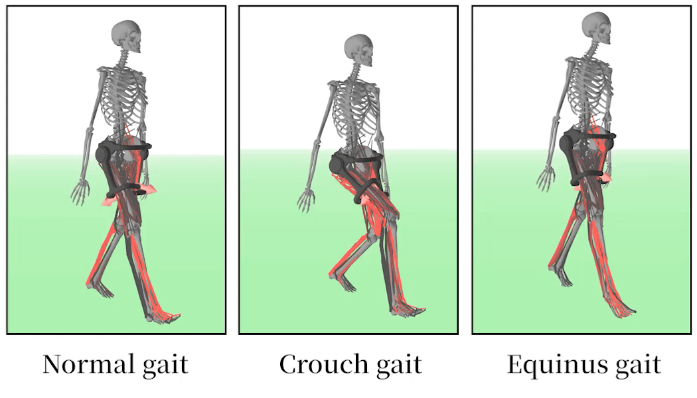
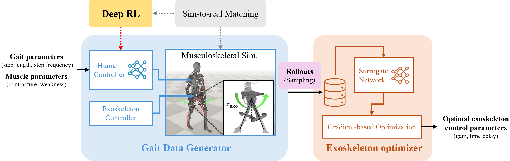

# Exo-plore: Exploring Exoskeleton Control Space through Human-Aligned Simulation

[Geonho Leem](https://daebangstn.github.io/)<sup>1</sup>,
[Jaedong Lee](https://jaedong-holiday.github.io/)<sup>2</sup>,
[Jehee Lee](https://mrl.snu.ac.kr/~jehee/)<sup>1</sup>,
[Seungmoon Song](http://seungmoon.com/)<sup>3</sup>,
[Jungdam Won](https://sites.google.com/view/jungdam)<sup>1</sup>

<sup>1</sup>Seoul National University, <sup>2</sup>Holiday Robotics, <sup>3</sup>Northeastern University

<p align="center">
  <a href="https://daebangstn.github.io/exo-plore/"><b>[Project Page]</b></a> &nbsp;&nbsp;
  <a href="https://arxiv.org/abs/2601.22550"><b>[Paper]</b></a> &nbsp;&nbsp;
  <a href="https://imolab-my.sharepoint.com/:f:/g/personal/geonholeem_imo_snu_ac_kr/IgBf_s4c-HLHRaNIwgMId1vfAZdPu9mfUIghLRW0Hr4vOTk?e=hsQIvm"><b>[Dataset]</b></a> &nbsp;&nbsp;
<p align="center">
  
</p>

> **Exo-plore** finds optimal exoskeleton control parameters using musculoskeletal simulation only.

## Abstract

Exoskeletons show great promise for enhancing mobility, but providing appropriate assistance remains challenging due to the complexity of human adaptation to external forces. Current state-of-the-art approaches for optimizing exoskeleton controllers require extensive human experiments in which participants must walk for hours, creating a paradox: those who could benefit most from exoskeleton assistance, such as individuals with mobility impairments, are often unable to participate in such demanding procedures. We present **Exo-plore**, a simulation framework that combines neuromechanical simulation with deep reinforcement learning to optimize hip exoskeleton assistance without requiring real human experiments. Exo-plore can (1) generate realistic gait data that captures human adaptation to assistive forces, (2) produce reliable optimization results despite the stochastic nature of human gait, and (3) generalize to pathological gaits, showing strong linear relationships between pathology severity and optimal assistance.

## Framework
<p align="center">
  
</p>


## Installation

See [docs/installation.md](docs/installation.md) for the full guide.

## Pipeline

See [docs/pipeline.md](docs/pipeline.md) for the full pipeline with step-by-step commands.

1. **Train RL Policy (Gait Data Generator)** — Train a musculoskeletal gait policy via PPO/Ray RLlib
2. **Rollout Gait Data Generator** — Convert checkpoint to TorchScript, sample parameter space, and run C++ rollouts
3. **Train NN Surrogate** — Learn a differentiable mapping from control parameters to metabolic cost
4. **Optimize Exoskeleton Parameters** — Gradient-based optimization through the surrogate to find optimal (K, Delay) per walking speed

## Data

See [docs/data.md](docs/data.md) for the complete data directory structure.

Configuration and resources (~105 MB) are under `data/`. Experiment data (~20 GB) are available for download from [onedrive](https://imolab-my.sharepoint.com/:f:/g/personal/geonholeem_imo_snu_ac_kr/IgBf_s4c-HLHRaNIwgMId1vfAZdPu9mfUIghLRW0Hr4vOTk?e=hsQIvm) and should be placed under `experiment_data/`.

## Figure Reproduction

See [docs/figures.md](docs/figures.md) for instructions on reproducing all paper figures.

<!-- ## Citation

```bibtex
@article{leem2025exoplore,
  title={Exo-plore: Exploring Exoskeleton Control Space through Human-Aligned Simulation},
  author={Leem, Geonho and Lee, Jaedong and Lee, Jehee and Song, Seungmoon and Won, Jungdam},
  year={2025}
}
``` -->

## Contact

[Geonho Leem](https://daebangstn.github.io/) — Seoul National University

## License

This project is licensed under the
**Creative Commons Attribution-NonCommercial-ShareAlike 4.0 International (CC BY-NC-SA 4.0)**.

### Commercial use
Commercial use is **NOT permitted** without a separate license agreement.
If you are interested in commercial use, please contact the author.
